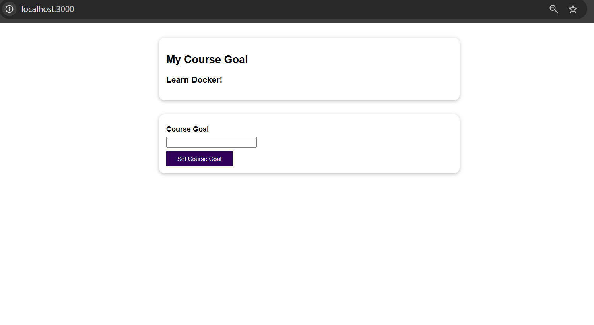
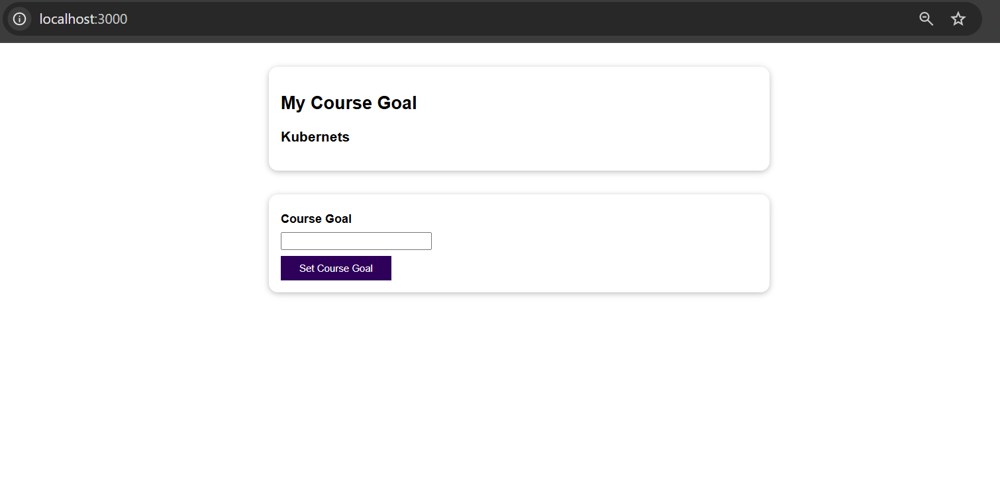

# eg_01_run_dockerized_go_webapp

## What this project does
This project demonstrates running a simple Go web application inside a Docker container using the official Go image.  
It executes the Go source code directly with `go run` without compiling a binary beforehand.  
This approach is useful for quick development and for learning Docker fundamentals.

## How to use

1. **Clone the repository**
```bash
git clone https://github.com/Abanu-H/docker-go-samples.git
```
2. **Navigate to the exercise directory**
```bash
cd docker-go-samples/eg_01_run_dockerized_go_webapp
```
3. **Build the Docker image - Builds a Docker image from the Dockerfile in the current directory.**
   - **-t** assigns a name (or "tag") to the image
   - **.** specifies the build context (current directory).
```bash
docker build -t run_dockerized_go_webapp .
```
4. **Run the container**
   - **-p** 3000:3000 maps port 3000 on your machine to port 3000 in the container.
   - **-d** runs the container in detached mode (in the background).
4. **Run the container**
  **-p** 3000:3000 maps port 3000 on your machine to port 3000 in the container.
  **-d** runs the container in detached mode (in the background).
```bash
docker run -p 3000:3000 -d run_dockerized_go_webapp
```
Server starts at http://localhost:3000.

5. **Test the app**

```bash
curl http://localhost:3000
```
***Home Page:**

***Post API Response:**

