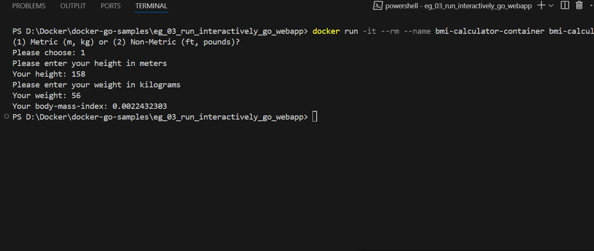

# eg_03_run_Interactively_go_webapp

## What this project does
This project demonstrates running a simple Go CLI application inside a Docker container using the official Go image.
The app calculates BMI (Body Mass Index) based on user input from the terminal.
It uses go run to execute the source code directly, making it suitable for learning how to interactively run CLI apps with Docker.

## How to use

1. **Clone the repository**
```bash
git clone https://github.com/Abanu-H/docker-go-samples.git
```
2. **Navigate to the exercise directory**
```bash
cd docker-go-samples/eg_03_run_interactive_go_cli_app
```
3. **Build the Docker image - Builds a Docker image from the Dockerfile in the current directory.**
   - **-t** assigns a name (or "tag") to the image
   - **.** specifies the build context (current directory).
```bash
docker build -t bmi-calculator .
```
4. **Run the container**
   - **-i** keeps STDIN open
   - **-t** allocates a TTY, enabling interactive input
   - **--name** assigns name to the container 
   - **--rm** Removed the container when its stopped 
```bash
docker run -it --rm --name bmi-calculator-container bmi-calculator
```

5. **Test the app**
The app calculate and provide the body mass index based on the height and weight inputs.





